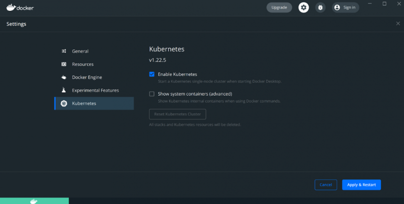

# Instructions for connecting to a Kubernetes cluster
### **Before you begin:**
> 1. **Just a reminder:** please make sure that you are connected to the Godel's VPN.
> 1.  Install and set up **`kubectl`** using this link: https://kubernetes.io/docs/tasks/tools/install-kubectl-windows <br/>

**Important note:** You must use a **`kubectl`** version that is within one minor version difference of your cluster. For example, a v1.27 client can communicate with v1.26, v1.27, and v1.28 control planes. Using the latest compatible version of **`kubectl`** helps avoid unforeseen issues.
> 3. Test to ensure the version of **`kubectl`** is the same as downloaded: </br>
```console
> kubectl version --output=json
{
  "clientVersion": {
    "major": "1",
    "minor": "25",
    "gitVersion": "v1.25.9",
    "gitCommit": "a1a87a0a2bcd605820920c6b0e618a8ab7d117d4",
    "gitTreeState": "clean",
    "buildDate": "2023-04-12T12:16:51Z",
    "goVersion": "go1.19.8",
    "compiler": "gc",
    "platform": "windows/amd64"
  },
  "kustomizeVersion": "v4.5.7"
}
```
> 4. **`Docker Desktop`** makes developing applications for Kubernetes easy. It provides a smooth Kubernetes setup experience by hiding the complexity of the installation and wiring with the host.</br>

**Note:** Please ensure, that you have it installed. Or you may install it using this link: https://docs.docker.com/desktop/install/windows-install

> 5. Kubernetes can be enabled from the Kubernetes settings panel as shown below:
 <br/> 
Checking the Enable Kubernetes box and then pressing Apply & Restart triggers the installation of a single-node Kubernetes cluster. </br>
After this step we have a default context and cluster provided by Docker. We can check it running kubectl commands. </br>
```console
> kubectl config current-context
docker-desktop
```
```console 
> kubectl config get-clusters
NAME
docker-desktop
```

## Configure access to Godel Technologies Cluster

At this step we have the default Kubernetes cluster provided by Docker, and the kubectl command-line tool configured to communicate with this cluster. We can quickly switch between clusters by using the `kubectl config use-context` command (here is a link if you need an additional information https://kubernetes.io/docs/tasks/access-application-cluster/configure-access-multiple-clusters).

### Configuration file
To connect to Godel's cluster we will use the config as shown below.
```yaml
apiVersion: v1
clusters:
  - cluster:
      certificate-authority-data: # hidden
      server: # hidden
    name: kubernetes
contexts:
  - context:
      cluster: kubernetes
      namespace: java # namespace name
      user: developer-java # user name
    name: developer-java@kubernetes
current-context: developer-java@kubernetes
kind: Config
preferences: {}
users:
  - name: developer-java
    user:
      client-certificate-data: # hidden
      client-key-data: # hidden
```
> Any important sensitive data is hidden here, but you can find this file by using the link: http://link.com (under Godel's VPN)
> 
**Note:** A file that is used to configure access to a cluster is sometimes called a **kubeconfig file**. This is a generic way of referring to configuration files. It does not mean that there is a file named `kubeconfig`. But, in our case, please save this config on your local computer as a file and name it as `kubeconfig` without any extension.

### Set the KUBECONFIG environment variable
See whether you have an environment variable named `KUBECONFIG`.</br>
The `KUBECONFIG` environment variable is a list of paths to configuration files. For Windows, the list is semicolon-delimited. If the `KUBECONFIG` environment variable does exist, `kubectl` uses an effective configuration that is the result of merging the files listed in the `KUBECONFIG` environment variable.</br>

If so, save the current value of your `KUBECONFIG` environment variable, so you can restore it later. For example:
```console
> $Env:KUBECONFIG_SAVED=$ENV:KUBECONFIG
```
Add our `kubeconfig` file to the `KUBECONFIG` environment variable as shown below.
```console
> $Env:KUBECONFIG=("<path-to-file>/kubeconfig")
```
To see your configuration, enter this command:
```console
> kubectl config view
```
And the output will look something like this:
```yaml
apiVersion: v1
clusters:
- cluster:
    certificate-authority-data: DATA+OMITTED
    server: https://192.168.80.98:6443
  name: kubernetes
contexts:
- context:
    cluster: kubernetes
    namespace: java
    user: developer-java
  name: developer-java@kubernetes
current-context: developer-java@kubernetes
kind: Config
preferences: {}
users:
- name: developer-java
  user:
    client-certificate-data: REDACTED
    client-key-data: REDACTED
```

And finally we can check the cluster:
```console
> kubectl cluster-info --namespace="java"
Kubernetes control plane is running at https://192.168.80.98:6443
```
The namespace:
```console
> kubectl get namespace java -o json
{
    "apiVersion": "v1",
    "kind": "Namespace",
    "metadata": {
        "creationTimestamp": "2023-05-22T20:16:52Z",
        "labels": {
            "kubernetes.io/metadata.name": "java"
        },
        "name": "java",
        "resourceVersion": "13811433",
        "uid": "5547353b-4dd9-4aa8-bdbc-72648d5175c4"
    },
    "spec": {
        "finalizers": [
            "kubernetes"
        ]
    },
    "status": {
        "phase": "Active"
    }
}
```

## We can now run `kubectl` commands and deploy applications.
